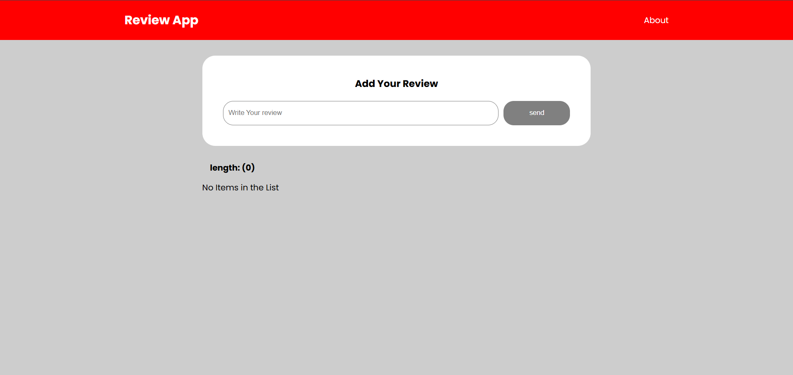

# Review App 📝

A simple **React application** that allows users to **add, edit, and delete reviews**.  
This project uses **JSON Server** as a mock backend to store review data locally and demonstrates basic **CRUD operations**.

---

## 📌 Features

- Add new reviews  
- Edit existing reviews  
- Delete reviews  
- View all reviews  
- Persistent data storage using JSON Server  

---

## 🛠️ Tech Stack

- **Frontend:** React (Functional Components, Hooks), Material UI.
- **API library:** Axios.
- **Module Bundler:** vite.
- **Backend:** JSON Server.
- **Language:** JavaScript (ES6+).
- **Styling:** CSS.

---


## ⚙️ Installation & Setup

### 1️⃣ Clone the Repository

```bash
git clone https://github.com/your-username/review-app.git

cd review-app
```

### 2️⃣ Install Dependencies
```bash
npm install
```

### 3️⃣ Start JSON Server

 - Go to **package.json** file.
 - In the scripts section add `"server": "npx json-server db.json"` command.
 - And the run the below command (in this repo it was already configured).

```bash
npm run server
```
or 

```bash
npx json-server db.json
```
the server will runs at `http://localhost:3000/posts`

### 4️⃣ Start the React App

``` bash
npm run dev
```

---

## 📷 Screenshots

<p align="center">
  
  
</p>

